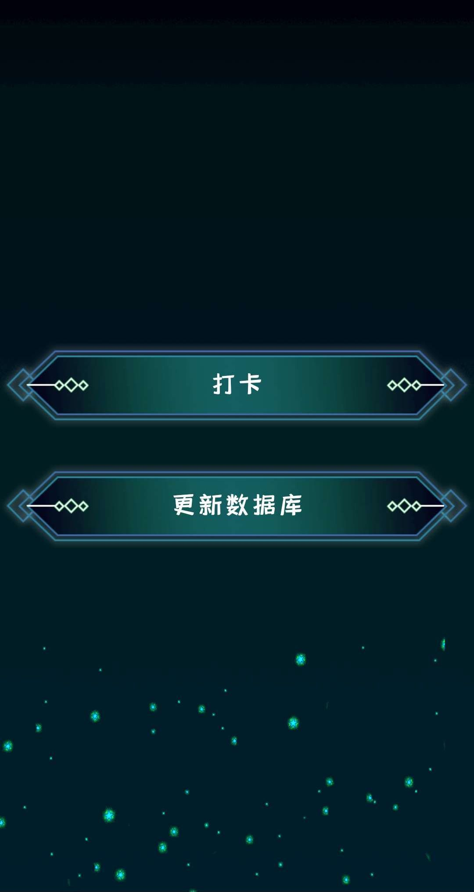

# Face-Recognition-with-ArcfaceDemo  
This is an app based on face recognition technology, which uses the arcfacedemo sdk. It can realize name recognition, age and gender prediction.
这是一款基于人脸识别的app，我们借助虹软所提供的免费的arcfacedemo的sdk，来实现活体的姓名识别，年龄和性别预测。 我们提供了从本地图片库进行匹配和从后台数据库导入图片到本地进行匹配两种解决方案，并且设计了属于自己的app风格，可用于公司和学校打卡等日常应用。 

# 配置说明
下载gradle-4.6并放到相应的文件夹中（自行百度）  
SDK选择Android7.0，安装Cmake和NDK（都在AS中可以安装）  
不支持Android10系统
在虹软官网申请API_ID和SDK_KEY填入到common/Constants文件中

# 具体操作  
在本机的文件目录下创建./arcfacedemo/register/和./arcfacedemo/failed/文件夹  
1.outline分支：  
  直接从本地图片库进行匹配，需要将待识别的人脸图片放入到./arcfacedemo/register/中并重命名图片名字为相对应的人的姓名。  
  进入界面后，点击更新数据库按钮即可激活引擎，激活之后会显示“激活成功”，然后点击上方第一个按钮就可以识别了。  
2.master分支（有连接自己数据库需要的可以作为参考，直接下载下来是不能运行的）：  
  从后台数据库导入图片到本地进行匹配，有需求的用户可创建自己的后台数据库，我们提供了一种从后台下载数据并匹配的方法的思路，由于实验室的数据库只能内网使用，所以不提供调用。  
  更改CameraActivity中的266和285行以及RegisterAndRecognizeActivity的第816行，改为自己的后台数据库的ip地址。  
  进入界面后，点击更新数据库按钮即可实现数据库的更新，这个操作只需要在第一次安装app和后台有数据更新时点击，它会删除本地的数据信息并且从后台下载新的信息，然后点击上方第一个按钮就可以进行引擎的激活和图片的注册并进行识别。   
  
# 运行结果

